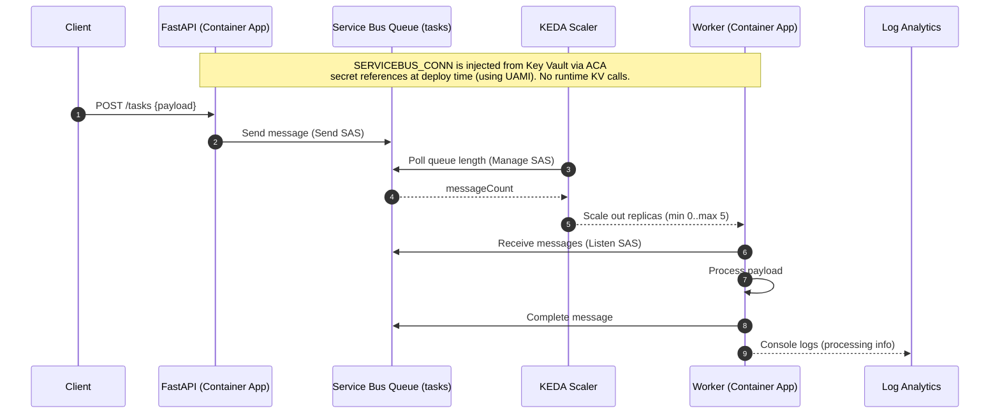

# DevSecOps Microservice on Azure

Spin up a tiny **event-driven system** on **Azure Container Apps (ACA)** using **Terraform** and **GitHub Actions (OIDC)**:

- **FastAPI** service (`POST /tasks`) enqueues JSON to **Azure Service Bus** (queue)
- **Worker** service consumes messages and processes them (scales 0→N with **KEDA**)
- **Terraform** provisions all cloud resources
- **GitHub Actions** handles **CI** (scan) + **Deploy** + **Destroy**
- **Key Vault** stores **queue-level SAS** (send, listen, manage) resolved at deploy time
- **User-Assigned Managed Identity (UAMI)** pulls images from ACR and resolves KV secrets
- **Log Analytics + (optional) App Insights (OTel)** for observability

> Shareable, reproducible, “nuke-and-recreate” demo or starter for lightweight production.

## 1) Architecture

*High-Level Overview*

```
            ┌──────────────┐       (SAS conn string stored in Key Vault)
HTTP POST ─►│  FastAPI     │ ───────────────────────────────────────────────────┐
            │  /tasks      │                                                    │
            └──────┬───────┘                                                    │
                   │ (send message)                                             │
                   ▼                                                            │
           ┌────────────────┐         KV ref ┌────────────────────┐             │
           │ Service Bus    │◄───────────────│ Azure Key Vault    │             │
           │ Queue (tasks)  │                │ secret: sb-conn    │             │
           └────────┬───────┘                └────────────────────┘             │
                    │ (scale trigger)                                           │
                    │ via KEDA                                                  │
                    ▼                                                           │
           ┌────────────────────┐         UAMI + KV ref                         │
           │ Worker (Container  │◄──────────────────────────────────────────────┘
           │ Apps, min=0)       │
           └────────────────────┘
                    │
                    ▼
           ┌─────────────────────┐
           │    Log Analytics    │   (logs/metrics; optional traces to App Insights)
           └─────────────────────┘
```
*Runtime Sequence*


*Flow*
- Client calls `POST /tasks` on the API → message goes to the Service Bus **queue**
    
- KEDA scales the worker based on **queue depth**
    
- Worker receives, processes, and completes messages
    
- Logs land in **Log Analytics**; optional traces in **App Insights**


## 2) What Terraform Deploys

- **Resource Group**: `rg-<prefix>` (created by workflow)
    
- **Log Analytics**: `<prefix>-la` (workspace)
    
- **Application Insights**: `<prefix>-appi` (workspace-based)
    
- **Key Vault**: `<prefix>-kv` (secrets for queue-level SAS)
    
- **ACR**: `<prefix>acr`
    
- **Service Bus**:
    
    - Namespace: `<prefix>-sbns`
        
    - Queue: `tasks` (default)
        
    - **Queue SAS rules**:
        
        - `api-send` (**Send**)
            
        - `worker-listen` (**Listen**)
            
        - `scale-manage` (**Manage** + Listen + Send; scaler needs Manage)
            
- **UAMI**: `<prefix>-uami` (granted ACR pull + KV secret read)
    
- **ACA Environment**: `<prefix>-acaenv`
    
- **Container Apps**:
    
    - `<prefix>-api` (FastAPI; ingress on `:8000`)
        
    - `<prefix>-worker` (KEDA scale rule on the queue; min=0, max=5)
        

**Secrets (via Key Vault references, resolved by ACA):**

- API container env `SERVICEBUS_CONN` ← KV secret **(send)**, secretRef e.g. `sb-send`
    
- Worker container env `SERVICEBUS_CONN` ← KV secret **(listen)**, secretRef e.g. `sb-listen`
    
- KEDA scale rule auth uses KV secret **(manage)**, secretRef e.g. `sb-manage` (not injected into container)
    

> The apps use the connection string path by default. You can toggle **Managed Identity** in the API for Service Bus (`USE_MANAGED_IDENTITY=true` + `SERVICEBUS_FQDN`), but it’s optional.

## 3) Prerequisites

- **GitHub OIDC** wired to your Azure tenant/subscription (no secrets).
    
- **Repo secrets**:
    
    - `AZURE_CLIENT_ID`, `AZURE_TENANT_ID`, `AZURE_SUBSCRIPTION_ID`
        
- **One-time role assignments** (run by a Subscription Owner):
    
    - Assign your GitHub OIDC app **Contributor** + **User Access Administrator** at the **subscription** scope.  
        This allows the workflows to **create the RG**, assign RG-scoped roles, and grant the **Storage Blob Data Contributor** role on the Terraform state account.
        

> The workflows create the **RG, ACR, KV, LA, TF state storage** if missing, and recover a **soft-deleted KV** automatically.

## 4) Repository layout
```
.
├─ .github/workflows/
│  ├─ ci.yml              # security CI (Checkov + Trivy)
│  ├─ deploy.yml          # infra bootstrap + build/push + deploy
│  └─ destroy.yml 
├─ app/
│  ├─ api/                # FastAPI producer
│  │  ├─ DOCKERFILE
│  │  ├─ main.py
│  │  └─ requirements.txt
│  └─ worker/             # queue consumer
│     ├─ DOCKERFILE
│     ├─ worker.py
│     └─ requirements.txt
└─ infra/
   ├─ backend.tf
   ├─ main.tf
   ├─ outputs.tf
   └─ variables.tf
```

## 5) CI/CD workflow
### CI (`.github/workflows/ci.yml`)

- Build API & Worker (Docker Buildx, with cache)
    
- Trivy image scan (HIGH/CRITICAL)
    
- Checkov Terraform scan
    

### Deploy (`.github/workflows/deploy.yml`)

- Bootstrap **RG + KV (recover if soft-deleted) + ACR + LA + TF state**
    
- Ensure CI has **Storage Blob Data Contributor** on TF state SA (AAD backend)
    
- Terraform **apply** core infra (SB, KV secrets, ACA env, UAMI, etc.)
    
- Build & push images to ACR (tagged with commit SHA)
    
- Terraform **apply** apps (pull from ACR; KV secret refs; UAMI-backed)
    
- Prints the public **FastAPI URL** as output
    

### Destroy (`.github/workflows/destroy.yml`)

- Terraform **destroy** all resources
    
- **Delete the entire RG** (async) to hit **$0**
    
- You can re-run **Deploy** anytime to fully recreate everything (including the RG)

## 6) First-run values (env)

## 7) Running it
- Push to `main` or trigger the **Deploy** workflow.
    
- After **create-apps**, get the public API URL:

`az containerapp show \   -g rg-devsecops-aca \   -n devsecopsaca-api \   --query properties.configuration.ingress.fqdn -o tsv`

`infra/outputs.tf` also exposes a `fastapi_url` output if you run Terraform locally.

## 8) Using the API
### Logs (CLI)

- **API (console)**
    
    `az containerapp logs show -g rg-devsecops-aca -n devsecopsaca-api --type console --follow --container api`
    
- **Worker (console)**
    
    `az containerapp logs show -g rg-devsecops-aca -n devsecopsaca-worker --type console --follow --container worker`
    
- **System logs**
    
    `az containerapp logs show -g rg-devsecops-aca -n devsecopsaca-api --type system --follow`
    

### KEDA scaling

Worker is configured:

- `min_replicas = 0`, `max_replicas = 5`
    
- 1 replica per **20 messages**:
    
    `custom_scale_rule {   name             = "sb-scaler"   custom_rule_type = "azure-servicebus"   metadata = { queueName = var.queue_name, messageCount = "20" }   authentication {     secret_name       = "sb-conn"     trigger_parameter = "connection"   } }`
    

Verify replicas:

`az containerapp show -g rg-devsecops-aca -n devsecopsaca-worker \   --query properties.template.replicas -o tsv`

Send a burst of messages to see it scale:

`for i in {1..100}; do   curl -sS -X POST "https://${API_FQDN}/enqueue" \        -H "content-type: application/json" \        -d '{"hello":"world"}' >/dev/null done`

### Common errors & fixes

- **403 listing blobs during `terraform init`**  
    Make sure the CI principal has **Storage Blob Data Contributor** on the state **storage account**. The workflow grants it; allow 30–60s for RBAC to propagate.
    
- **Resource already exists — import required**  
    The workflow does imports before apply. If running locally:  
    `terraform import <addr> <id>` using the IDs echoed in the error.
    
- **`Failed to provision revision: 'sb-conn' unable to get value using Managed identity 'System'`**
    
    - In `azurerm_container_app.secret` blocks, ensure `identity = "System"`.
        
    - Ensure Key Vault **access policies** allow each app’s **system-assigned MI** to **Get/List secrets**.
        
    - Ensure the CI principal had permission to initially **create** `ServiceBusConnection` (policy `kv_ci`).
        
- **KEDA not scaling**
    
    - Make sure the SAS rule used for the connection string has **Listen** permission (we set Listen+Send on `app-shared`).
        
    - Queue name in the scaler metadata matches the actual queue.
        
    - Generate enough messages to exceed `messageCount` threshold.
        
- **Max delivery count / DLQ**  
    Your worker must `complete_message()` (or `abandon/dead_letter` appropriately) and auto-renew locks for long work. See the “max delivery” notes in the discussion above.

## 9) Observability & troubleshooting
### Logs (CLI)

- **API (console)**
    
    `az containerapp logs show -g rg-devsecops-aca -n devsecopsaca-api --type console --follow --container api`
    
- **Worker (console)**
    
    `az containerapp logs show -g rg-devsecops-aca -n devsecopsaca-worker --type console --follow --container worker`
    
- **System logs**
    
    `az containerapp logs show -g rg-devsecops-aca -n devsecopsaca-api --type system --follow`

## 10) Working with Terraform locally
If you want to inspect or modify:

`cd infra  terraform init \   -backend-config="resource_group_name=rg-devsecops-aca" \   -backend-config="storage_account_name=stdevsecopsacatfstate" \   -backend-config="container_name=tfstate" \   -backend-config="key=devsecopsaca.tfstate" \   -backend-config="use_azuread_auth=true"  terraform plan \   -var="prefix=devsecopsaca" \   -var="location=eastus" \   -var="resource_group_name=rg-devsecops-aca" \   -var="queue_name=tasks" \   -var="create_apps=true" \   -var="image_tag=<some-tag>"`

> If you see a state **lease** error, break the stale lease:
> 
> `az storage blob lease break \   --account-name stdevsecopsacatfstate \   --container-name tfstate \   --blob-name devsecopsaca.tfstate \   --auth-mode login`

## 11) Costs & clean-up
- **Service Bus Standard**, **App Insights/Log Analytics**, and image storage can incur cost even when apps scale to zero.
    
- Easiest **stop** options:
    
    1. **Scale to zero** the API as well (set `min_replicas = 0`) or disable ingress.
        
    2. **Terraform destroy** (recommended; only removes Terraform-managed resources):
        
        `cd infra terraform destroy \   -var="prefix=devsecopsaca" \   -var="location=eastus" \   -var="resource_group_name=rg-devsecops-aca" \   -var="queue_name=tasks" \   -var="create_apps=true"`
        
    3. As a last resort: delete the **resource group** (will also delete base resources you might want to keep).
        

To restart later, just re-run the **Deploy** workflow.

## 12) Security notes
- CI uses **OIDC** (no long-lived secrets).
    
- Terraform backend uses **AAD** for data-plane auth (no account keys).
    
- Secrets are in **Key Vault**; Container Apps read them via **managed identity** + **secret references**.
    
- Role assignments are minimal for runtime (ACR Pull, KV Read).

## 13) How the app code works (quick tour)
**API (`app/api/main.py`)**

- `POST /enqueue` -> validates JSON, sends to queue using the connection string from KV secret `sb-conn`.
    
- `GET /health` -> basic health.
    

**Worker (`app/worker/worker.py`)**

- Uses `azure-servicebus` to receive messages.
    
- Logs `"Processing: <payload>"`.
    
- In a production scenario you would **renew the lock** during long work and call `complete_message()` on success.

## 14) Extending this project (future work)

## 15) FAQ

**Where is my API URL?**  
`az containerapp show -g rg-devsecops-aca -n devsecopsaca-api --query properties.configuration.ingress.fqdn -o tsv`

**How do I tail logs?**  
`az containerapp logs show -g <rg> -n <app> --type console --follow`

**Why did Terraform say “resource already exists”?**  
Because you pre-created it. Import it into state (the workflow does this automatically).

**Why can’t the app read `sb-conn` from Key Vault?**  
Make sure the secret block has `identity = "System"` and the app’s MI has KV secret **Get/List** via access policy.