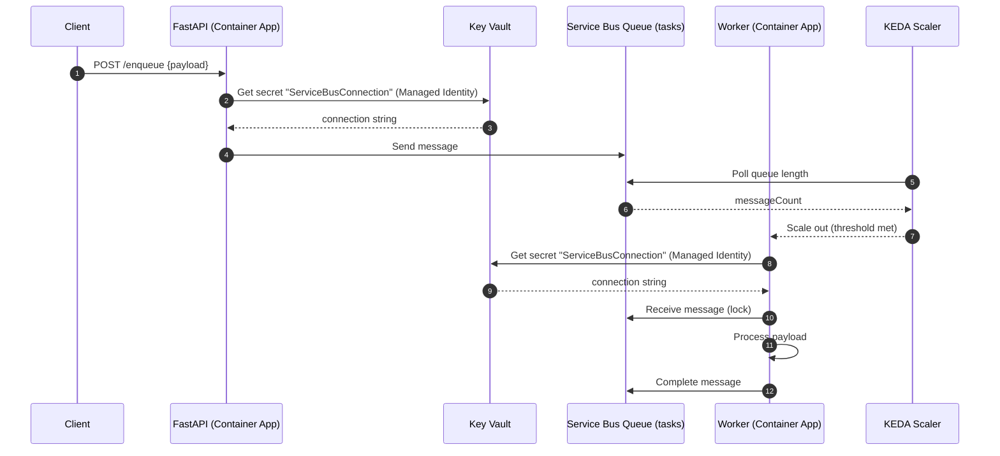

# DevSecOps Microservice on Azure

Spin up a tiny **event-driven system** on Azure using **Terraform** and **GitHub Actions (OIDC)**:

- **FastAPI** “producer” (HTTP) → pushes JSON to **Azure Service Bus** (queue)
    
- **Worker** “consumer” → reads the queue and logs processing
    
- **KEDA** auto-scales the worker based on queue depth
    
- **Key Vault** holds the Service Bus connection string; apps read it via **managed identity**
    
- **Application Insights** + **Log Analytics** for observability
    
- **Container Apps** (Consumption) for serverless containers
    
- **ACR** for container images
    
- **Terraform backend** in a Storage Account (RBAC/AAD auth)

> This README explains **what you get**, **how it works**, **how to run it**, **how to test/observe it**, and **how to clean up**. It also captures the snags we hit (and fixes), plus ideas for future expansion.

## 1) Architecture

```
            ┌──────────────┐       (SAS conn string stored in Key Vault)
HTTP POST ─►│  FastAPI     │ ───────────────────────────────────────────────────┐
            │  /enqueue    │                                                    │
            └──────┬───────┘                                                    │
                   │ (send message)                                             │
                   ▼                                                            │
           ┌────────────────┐         KV ref ┌────────────────────┐             │
           │ Service Bus    │◄───────────────│ Azure Key Vault    │             │
           │ Queue (tasks)  │                │ secret: sb-conn    │             │
           └────────┬───────┘                └────────────────────┘             │
                    │ (scale trigger)                                           │
                    │ via KEDA                                                  │
                    ▼                                                           │
           ┌────────────────────┐         MI + KV ref                           │
           │ Worker (Container  │◄──────────────────────────────────────────────┘
           │ Apps, min=0)       │
           └────────────────────┘
                    │
                    ▼
           ┌─────────────────────┐
           │ App Insights + LA   │   (logs/metrics/trace)
           └─────────────────────┘
```
*Runtime Sequence*



## 2) What gets created vs. re-used

This project **re-uses** several “foundation” resources (looked up as Terraform **data** sources):

- `rg-<prefix>` resource group (you provide it)
    
- `st<tfstate>` storage account + `tfstate` container (the workflow bootstraps it)
    
- `devsecopsacaacr` ACR
    
- `devsecopsaca-kv` Key Vault
    
- `devsecopsaca-sbns` Service Bus namespace
    
- `devsecopsaca-la` Log Analytics workspace
    

Terraform **creates / manages**:

- `devsecopsaca-appi` **Application Insights**
    
- `tasks` **Service Bus queue** + `app-shared` **namespace SAS rule**
    
- **Key Vault secret** `ServiceBusConnection` (`sb-conn`)
    
- `devsecopsaca-acaenv` **Container Apps Environment (Consumption)**
    
- `devsecopsaca-api` FastAPI app (ingress)
    
- `devsecopsaca-worker` Worker app (KEDA scaler)
    
- **ACR Pull** role assignments for the two apps
    
- **Key Vault access policies** for CI (to set secret) and the app MIs (to read secret)


> Import logic is included in the CI so if an object already exists, it’s **imported into TF state** instead of failing.

## 3) Prerequisites
- Azure subscription + resource group (e.g. `rg-devsecops-aca`) in a region that supports Container Apps.
    
- GitHub repository with **Actions OIDC** wired to your tenant/subscription.
    
- Create a service principal for CI (or reuse one), add a **Federated Credential** for GitHub Actions, then grant it:
    
    - At the **resource group** scope: **Contributor** and **User Access Administrator**  
        (User Access Administrator is needed so Terraform can create role assignments, e.g., ACR Pull.)
        
- Repo **Secrets**:
    
    - `AZURE_CLIENT_ID`
        
    - `AZURE_TENANT_ID`
        
    - `AZURE_SUBSCRIPTION_ID`

## 4) Repository layout
```
.
├─ .github/workflows/
│  ├─ ci.yml              # security CI (Checkov + Trivy)
│  └─ deploy.yml          # infra bootstrap + build/push + deploy
├─ app/
│  ├─ api/                # FastAPI producer
│  │  ├─ DOCKERFILE
│  │  ├─ main.py
│  │  └─ requirements.txt
│  └─ worker/             # queue consumer
│     ├─ DOCKERFILE
│     ├─ worker.py
│     └─ requirements.txt
└─ infra/
   ├─ backend.tf
   ├─ main.tf
   ├─ outputs.tf
   └─ variables.tf
```

## 5) CI/CD workflow (deploy.yml)
The pipeline runs on pushes to `main` (and on demand):

1. **infra-bootstrap**
    
    - Azure OIDC login
        
    - Creates/ensures the **Terraform state storage** (Storage Account + container)
        
    - Grants the CI principal **Storage Blob Data Contributor** on the SA (for AAD data-plane auth)
        
    - `terraform init` with backend config (AAD auth)
        
    - Imports existing resources (safe if absent)
        
    - `terraform apply` for **infra only** (no apps yet)
        
2. **build-and-push**
    
    - Builds API and Worker images and pushes to **ACR**
        
3. **create-apps**
    
    - `terraform init` (same backend)
        
    - Imports Container Apps if they already exist (safe if absent)
        
    - `terraform apply` to deploy **api/worker** with the new image tags
        

> The workflow is idempotent and includes small guards: breaking stale TF state lease, safe imports, and a few retries.

## 6) First-run values (env)

## 7) Running it
- Push to `main` or trigger the **Deploy** workflow.
    
- After **create-apps**, get the public API URL:

`az containerapp show \   -g rg-devsecops-aca \   -n devsecopsaca-api \   --query properties.configuration.ingress.fqdn -o tsv`

`infra/outputs.tf` also exposes a `fastapi_url` output if you run Terraform locally.

## 8) Using the API
### Logs (CLI)

- **API (console)**
    
    `az containerapp logs show -g rg-devsecops-aca -n devsecopsaca-api --type console --follow --container api`
    
- **Worker (console)**
    
    `az containerapp logs show -g rg-devsecops-aca -n devsecopsaca-worker --type console --follow --container worker`
    
- **System logs**
    
    `az containerapp logs show -g rg-devsecops-aca -n devsecopsaca-api --type system --follow`
    

### KEDA scaling

Worker is configured:

- `min_replicas = 0`, `max_replicas = 5`
    
- 1 replica per **20 messages**:
    
    `custom_scale_rule {   name             = "sb-scaler"   custom_rule_type = "azure-servicebus"   metadata = { queueName = var.queue_name, messageCount = "20" }   authentication {     secret_name       = "sb-conn"     trigger_parameter = "connection"   } }`
    

Verify replicas:

`az containerapp show -g rg-devsecops-aca -n devsecopsaca-worker \   --query properties.template.replicas -o tsv`

Send a burst of messages to see it scale:

`for i in {1..100}; do   curl -sS -X POST "https://${API_FQDN}/enqueue" \        -H "content-type: application/json" \        -d '{"hello":"world"}' >/dev/null done`

### Common errors & fixes

- **403 listing blobs during `terraform init`**  
    Make sure the CI principal has **Storage Blob Data Contributor** on the state **storage account**. The workflow grants it; allow 30–60s for RBAC to propagate.
    
- **Resource already exists — import required**  
    The workflow does imports before apply. If running locally:  
    `terraform import <addr> <id>` using the IDs echoed in the error.
    
- **`Failed to provision revision: 'sb-conn' unable to get value using Managed identity 'System'`**
    
    - In `azurerm_container_app.secret` blocks, ensure `identity = "System"`.
        
    - Ensure Key Vault **access policies** allow each app’s **system-assigned MI** to **Get/List secrets**.
        
    - Ensure the CI principal had permission to initially **create** `ServiceBusConnection` (policy `kv_ci`).
        
- **KEDA not scaling**
    
    - Make sure the SAS rule used for the connection string has **Listen** permission (we set Listen+Send on `app-shared`).
        
    - Queue name in the scaler metadata matches the actual queue.
        
    - Generate enough messages to exceed `messageCount` threshold.
        
- **Max delivery count / DLQ**  
    Your worker must `complete_message()` (or `abandon/dead_letter` appropriately) and auto-renew locks for long work. See the “max delivery” notes in the discussion above.

## 9) Observability & troubleshooting
### Logs (CLI)

- **API (console)**
    
    `az containerapp logs show -g rg-devsecops-aca -n devsecopsaca-api --type console --follow --container api`
    
- **Worker (console)**
    
    `az containerapp logs show -g rg-devsecops-aca -n devsecopsaca-worker --type console --follow --container worker`
    
- **System logs**
    
    `az containerapp logs show -g rg-devsecops-aca -n devsecopsaca-api --type system --follow`

## 10) Working with Terraform locally

## 11) Costs & clean-up

## 12) Security notes

## 13) How the app code works (quick tour)

## 14) Extending this project (future work)

## 15) FAQ