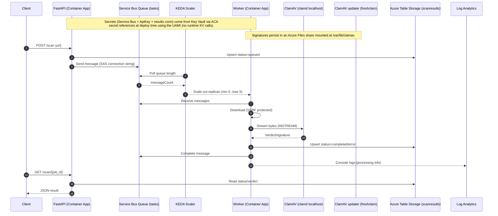

# URL Scanner Pipeline on Azure (ACA)

End-to-end, cloud-native **URL scanning pipeline** on **Azure Container Apps (ACA)** using **Terraform** and **GitHub Actions (OIDC)**.

What this project demonstrates (resume-friendly):

- **DevSecOps Approach**: Focused on implementing infrastructure in an automated, shift-left manner
- **Secure API surface**: `X-API-Key` auth + per-key rate limiting + SSRF protections
- **Async job processing**: API enqueues scan jobs to **Service Bus** (or Redis locally), worker processes jobs (KEDA autoscaling on Azure)
- **Results + audit trail**: scan results stored in **Azure Table Storage** (`scanresults`) (or Redis locally)
- **DevSecOps CI/CD**: Checkov + Trivy in CI; Deploy workflow includes health + end-to-end smoke tests
- **Cloud-native secrets**: **Key Vault** stores secrets, resolved by **UAMI** at deploy/runtime
- **Built-in UI**: minimal dashboard at `/` plus Swagger at `/docs`

> Shareable, reproducible, “nuke-and-recreate” demo or starter for lightweight production.

## 0) Quick demo (local, ~2 minutes)

Prereqs: Docker Desktop (or any Docker engine with Compose).

```bash
cp .env.example .env
docker compose up --build
```

In another terminal:

```bash
API_KEY=local-dev-key

curl -sS http://localhost:8000/healthz

SUBMIT="$(curl -sS -X POST http://localhost:8000/scan \
  -H "content-type: application/json" \
  -H "X-API-Key: ${API_KEY}" \
  -d '{"url":"https://example.com","type":"url"}')"
echo "${SUBMIT}"

JOB_ID="$(python3 -c 'import json,sys; print(json.loads(sys.stdin.read()).get("job_id") or "")' <<<"${SUBMIT}")"
curl -sS "http://localhost:8000/scan/${JOB_ID}" -H "X-API-Key: ${API_KEY}"
```

SSRF protections (expected `400`):

```bash
curl -i -sS -X POST http://localhost:8000/scan \
  -H "content-type: application/json" \
  -H "X-API-Key: ${API_KEY}" \
  -d '{"url":"https://127.0.0.1","type":"url"}'
```

> Note: first local run may take a few minutes while `clamav-updater` downloads signatures. For faster local iteration, set `SCAN_ENGINE=reputation` (or `SCAN_ENGINE=yara`) in `.env`.

## 1) Architecture

*High-Level Overview*

```
            ┌──────────────┐       (SAS conn string stored in Key Vault)
HTTP POST ─►│  FastAPI     │ ───────────────────────────────────────────────────┐
            │  /scan       │                                                    │
            └──────┬───────┘                                                    │
                   │ (send message)                                             │
                   ▼                                                            │
           ┌────────────────┐         KV ref ┌────────────────────┐             │
           │ Service Bus    │◄───────────────│ Azure Key Vault    │             │
           │ Queue (tasks)  │                │ secrets: sb-* + ApiKey           │
           └────────┬───────┘                └────────────────────┘             │
                    │ (scale trigger)                                           │
                    │ via KEDA                                                  │
                    ▼                                                           │
           ┌────────────────────┐         UAMI + KV ref                         │
           │ Worker (Container  │◄──────────────────────────────────────────────┘
           │ Apps, min=0)       │
           └────────────────────┘
                 │         │
        (writes results)   │ (scan via clamd localhost:3310)
                 ▼         ▼
      ┌────────────────┐  ┌─────────────────────┐
      │ Azure Table    │  │  ClamAV (clamd)     │
      │ scanresults    │  │  inside worker      │
      └────────────────┘  └─────────────────────┘
                 ▲
                 │ (signatures via shared volume)
      ┌─────────────────────┐
      │ Azure Files share   │
      │ (<prefix>-clamav-db)│
      └─────────────────────┘
                 ▲
                 │ (freshclam update loop)
      ┌─────────────────────┐
      │ ClamAV updater app  │
      │ (<prefix>-clamav-updater) │
      └─────────────────────┘
                  │
            (logs/metrics)
                  ▼
      ┌─────────────────────┐   (optional traces to App Insights)
      │    Log Analytics    │
      └─────────────────────┘
```
*Runtime Sequence*


*Flow*
- Client calls `POST /scan` on the API → message goes to the Service Bus **queue**
    
- KEDA scales the worker based on **queue depth**
    
- Worker receives, processes, and completes messages
    
- Results are written to **Table Storage** (`scanresults`) and can be fetched via `GET /scan/{job_id}`
- Logs land in **Log Analytics**; optional traces in **App Insights**


## 2) What Terraform Deploys

- **Resource Group**: `rg-<prefix>` (created by workflow)
    
- **Log Analytics**: `<prefix>-la` (workspace)
    
- **Application Insights**: `<prefix>-appi` (workspace-based)
    
- **Key Vault**: `<prefix>-kv` (secrets: Service Bus SAS, scan results conn, API key)
    
- **ACR**: `<prefix>acr`

- **Service Bus**:
    
    - Namespace: `<prefix>-sbns`
        
    - Queue: `tasks` (default)
        
    - **Queue SAS rules**:
        
        - `api-send` (**Send**)
        
        - `worker-listen` (**Listen**)
            
        - `scale-manage` (**Manage** + Listen + Send; scaler needs Manage)
            
- **Storage (results)**:
    
    - Account: `<prefix>scan`
        
    - Table: `scanresults` (default)
        
    - KV secret: `ScanResultsConn` (table connection string for API/worker)
        
- **UAMI**: `<prefix>-uami` (granted ACR pull + KV secret read)
    
- **ACA Environment**: `<prefix>-acaenv`
    
- **Container Apps**:
    
    - `<prefix>-api` (FastAPI; ingress on `:8000`)
        
    - `<prefix>-worker` (KEDA scale rule on the queue; min=0, max=5; runs `clamd` locally)

    - `<prefix>-clamav-updater` (ClamAV signatures updater; mounts Azure Files share and runs `freshclam` loop)
        
    - Azure Files share: `<prefix>-clamav-db` (persisted ClamAV signature database)

**Secrets (via Key Vault references, resolved by ACA):**

- API container env `SERVICEBUS_CONN` ← KV secret **(send)**, secretRef e.g. `sb-send`
- API container env `API_KEY` ← KV secret `ApiKey`, secretRef `api-key`
    
- Worker container env `SERVICEBUS_CONN` ← KV secret **(listen)**, secretRef e.g. `sb-listen`
    
- KEDA scale rule auth uses KV secret **(manage)**, secretRef e.g. `sb-manage` (not injected into container)
    
- API/worker env `RESULT_STORE_CONN` and `RESULT_TABLE` for scan status storage (from Storage Table)

- Worker env `CLAMAV_HOST=127.0.0.1` + `CLAMAV_PORT=3310` point to the local `clamd` process (not secrets)
    

> The apps use the connection string path by default. You can toggle **Managed Identity** in the API for Service Bus (`USE_MANAGED_IDENTITY=true` + `SERVICEBUS_FQDN`), but it’s optional.

## 3) Prerequisites

- **GitHub OIDC** wired to your Azure tenant/subscription (no secrets).
    
- **Repo secrets**:
    
    - `AZURE_CLIENT_ID`, `AZURE_TENANT_ID`, `AZURE_SUBSCRIPTION_ID`
        
- **One-time role assignments** (run by a Subscription Owner):
    
    - Assign your GitHub OIDC app **Contributor** + **User Access Administrator** at the **subscription** scope.  
        This allows the workflows to **create the RG**, assign RG-scoped roles, and grant the **Storage Blob Data Contributor** role on the Terraform state account.
        

> The workflows create the **RG, ACR, KV, LA, TF state storage** if missing, and recover a **soft-deleted KV** automatically.

### One-time setup (Azure + GitHub OIDC checklist)

1. Create an **Entra ID App Registration** (service principal) for GitHub Actions.
2. Add a **Federated Credential** to the app registration (no client secret):
   - Issuer: `https://token.actions.githubusercontent.com`
   - Subject: `repo:<owner>/<repo>:ref:refs/heads/main`
   - Audience: `api://AzureADTokenExchange`
3. Assign the service principal:
   - `Contributor` (subscription scope)
   - `User Access Administrator` (subscription scope; needed so the workflow can create RBAC assignments for the TF state data plane)
4. Add GitHub repo secrets:
   - `AZURE_CLIENT_ID` (app/client id)
   - `AZURE_TENANT_ID`
   - `AZURE_SUBSCRIPTION_ID`

## 4) Repository layout
```
azure-devsecops-aca/
├─ .github/workflows/
│  ├─ ci.yml              # security CI (Checkov + Trivy)
│  ├─ deploy.yml          # infra bootstrap + build/push + deploy
│  └─ destroy.yml         # terraform destroy (+ RG delete)
├─ scripts/gha/           # workflow bash logic (for readability)
│  ├─ deploy_infra_bootstrap.sh
│  ├─ deploy_create_apps_and_test.sh
│  └─ destroy.sh
├─ app/
│  ├─ common/             # shared helpers (validation + result storage)
│  ├─ api/                # FastAPI producer
│  │  ├─ Dockerfile
│  │  ├─ dashboard.html
│  │  ├─ main.py
│  │  └─ requirements.txt
│  ├─ clamav/             # ClamAV updater image + configs (freshclam + healthcheck helper)
│  │  ├─ Dockerfile
│  │  ├─ clamd.sidecar.conf
│  │  ├─ freshclam.conf
│  │  ├─ freshclam-updater.sh
│  │  └─ healthcheck.sh
│  └─ worker/             # queue consumer
│     ├─ Dockerfile.sidecar
│     ├─ worker.py
│     ├─ requirements.txt
│     └─ yara-rules/
│        └─ default.yar
├─ infra/
│  ├─ backend.tf
│  ├─ main.tf             # providers + locals
│  ├─ core.tf             # core infra (SB, ACA env, etc.)
│  ├─ keyvault.tf         # KV perms + secrets
│  ├─ apps.tf             # Container Apps (create_apps)
│  ├─ outputs.tf
│  └─ variables.tf
├─ docs/
├─ checkov.yml
└─ README.md
```

## 5) CI/CD workflow
### CI (`.github/workflows/ci.yml`)

- Build API, Worker, and ClamAV (Docker Buildx, with cache)
    
- Trivy image scan (HIGH/CRITICAL)
    
- Checkov Terraform scan
    

### Deploy (`.github/workflows/deploy.yml`)

- Bootstrap **RG + KV (recover if soft-deleted) + ACR + LA + TF state**
    
- Ensure CI has **Storage Blob Data Contributor** on TF state SA (AAD backend)
    
- Terraform **apply** core infra (SB, KV secrets, ACA env, UAMI, etc.)
    
- Build & push images to ACR (tagged with commit SHA)
    
- Terraform **apply** apps (pull from ACR; KV secret refs; UAMI-backed)
    
- Prints the public **FastAPI URL** as output

- Runs smoke tests:
    - `GET /healthz`
    - end-to-end scan: `POST /scan` then poll `GET /scan/{job_id}` until `completed`

> Docs-only changes (`**/*.md`, `docs/**`) do not trigger CI; Deploy is manual (`workflow_dispatch`).
    
### KEDA Scale Test (`.github/workflows/keda-scale-test.yml`)

Manual workflow (`workflow_dispatch`) to validate **KEDA scale-out**:

- Enqueues a burst of scan messages directly to **Service Bus** (bypasses API rate limiting).
- Polls worker replica count until it reaches `expected_min_replicas`.

You can run the same check locally:

```bash
python3 -m pip install -r app/worker/requirements.txt
az login
bash scripts/keda_scale_test.sh --resource-group <rg> --prefix <prefix>
```


### Destroy (`.github/workflows/destroy.yml`)

- Terraform **destroy** all resources
    
- **Delete the entire RG** (async) to hit **$0**
    
- You can re-run **Deploy** anytime to fully recreate everything (including the RG)

## 6) First-run values (env)

### API key (required)

The **Deploy** workflow generates a (shared) API key and stores it in **Key Vault** as the secret `ApiKey`.

- The deploy workflow uses the key for its smoke/e2e tests, but **does not print it** to GitHub Actions logs.
- If you’re consuming someone else’s deployment, you’ll need the owner to share an API key (there is no self-service signup yet).

Retrieve it with Azure CLI (example):

```bash
KV_NAME="<prefix>-kv"
API_KEY="$(az keyvault secret show --vault-name "$KV_NAME" --name ApiKey --query value -o tsv)"
```

If you get `ForbiddenByRbac`, your identity doesn’t have Key Vault RBAC to read secrets. Grant yourself the **Key Vault Secrets User** role on the vault (example):

```bash
RG="<resource-group>"
KV_NAME="<prefix>-kv"
KV_ID="$(az keyvault show -g "$RG" -n "$KV_NAME" --query id -o tsv)"
ME_OID="$(az ad signed-in-user show --query id -o tsv)"

az role assignment create \
  --assignee-object-id "$ME_OID" \
  --assignee-principal-type User \
  --role "Key Vault Secrets User" \
  --scope "$KV_ID"
```

Then wait ~30–60 seconds for RBAC propagation and retry.

Use it on requests:

`-H "X-API-Key: $API_KEY"`

#### Rotate the API key (optional)

If you want to rotate the shared key, replace the Terraform resource and apply again:

```bash
cd infra
terraform apply \
  -replace="random_password.api_key" \
  -var="create_apps=true" \
  -var="image_tag=<tag>"
```

### Security defaults

- **SSRF protection**: only `https://` targets on port **443**; blocks targets that resolve to non-public IP ranges.
- **Rate limiting**: `60` requests/minute per API key (configure via Terraform var `api_rate_limit_rpm`).
- **Defense in depth**: the worker re-validates targets and validates every redirect hop.

## 7) Running it

### Local (Docker Compose)

Prereqs: Docker Desktop (or any Docker engine with Compose).

```bash
cp .env.example .env  # optional: tweak defaults (API key, rate limits, etc.)
docker compose up --build
```

- API: `http://localhost:8000`
- Web UI: `http://localhost:8000/`
- Swagger: `http://localhost:8000/docs`

Default API key: `local-dev-key` (change via `.env`).

> Note: the first run may take a few minutes while `clamav-updater` downloads signatures into the shared volume (the worker waits for them).
> If you want a faster local loop, set `SCAN_ENGINE=reputation` (or `SCAN_ENGINE=yara`) in `.env`.
> YARA rules live at `app/worker/yara-rules/default.yar` (override with `YARA_RULES_PATH`); the worker also records matching string snippets and you can control which rule severities affect the verdict via `YARA_VERDICT_MIN_SEVERITY`.
> You can also add `reputation` to `SCAN_ENGINE` to score domains (configurable allow/block lists + heuristics). If you want to block downloads for known-bad domains, set `REPUTATION_BLOCK_ON_MALICIOUS=true`.
> Demo marker: set `ENABLE_DEMO_MARKERS=true` to treat URLs containing the substring `test-malicious` as malicious (off by default).

#### Docker “\<none\>” images (dangling)

If you rebuild often, Docker will keep old, untagged images (shown as `\<none\>`) when a new build replaces the tag. They’re safe to delete.

- Remove dangling images: `bash scripts/docker_cleanup.sh`
- Also remove build cache (more aggressive): `PRUNE_BUILD_CACHE=true bash scripts/docker_cleanup.sh`

### Azure (Container Apps)
- Trigger the **Deploy** workflow manually (Actions tab → Deploy → Run workflow).
  - For forks: set a unique `PREFIX` and `TFSTATE_SA` via workflow inputs (storage account names are global).
    
- After **create-apps**, get the public API URL:

```bash
API_FQDN="$(az containerapp show -g rg-devsecops-aca -n devsecopsaca-api --query properties.configuration.ingress.fqdn -o tsv)"
API_URL="https://${API_FQDN}"
echo "$API_URL"
```

`infra/outputs.tf` also exposes a `fastapi_url` output if you run Terraform locally.

### Azure quickstart (user workflow)

1. Run **Deploy** from GitHub Actions (Actions tab → Deploy → Run workflow).
2. Get the API URL (output or `az containerapp show ...`).
3. Get the API key from Key Vault: `ApiKey`.
4. Open the web UI at `https://<api-fqdn>/` and paste the API key.
5. Submit a scan and watch status/results update in the UI.

Example CLI setup:

```bash
API_FQDN="$(az containerapp show -g rg-devsecops-aca -n devsecopsaca-api --query properties.configuration.ingress.fqdn -o tsv)"
API_URL="https://${API_FQDN}"
API_KEY="$(az keyvault secret show --vault-name devsecopsaca-kv --name ApiKey --query value -o tsv)"
```

## 8) Using the API

### GUI + Swagger

- Local Web UI: `http://localhost:8000/`
- Local Swagger: `http://localhost:8000/docs`
- Azure Web UI: `https://<api-fqdn>/`
- Azure Swagger: `https://<api-fqdn>/docs`
- Azure ReDoc: `https://<api-fqdn>/redoc`

### Endpoints

- `GET /` (no auth; dashboard UI)
- `GET /healthz` (no auth)
- `POST /tasks` (requires API key)
- `POST /scan` (requires API key)
- `GET /scan/{job_id}?view=summary|full` (requires API key; `summary` is default)

### Try it (CLI)

Submit a scan:

```bash
submit="$(curl -sS -X POST "${API_URL}/scan" \
  -H "content-type: application/json" \
  -H "X-API-Key: ${API_KEY}" \
  -d '{"url":"https://example.com","type":"url"}')"

JOB_ID="$(python3 -c 'import json,sys; print(json.loads(sys.stdin.read())["job_id"])' <<<"$submit")"
echo "JOB_ID=$JOB_ID"
```

Poll for status/result:

```bash
curl -sS "${API_URL}/scan/${JOB_ID}?view=summary" -H "X-API-Key: ${API_KEY}" | python3 -m json.tool
curl -sS "${API_URL}/scan/${JOB_ID}?view=full" -H "X-API-Key: ${API_KEY}" | python3 -m json.tool
```

Test “malicious” behavior (ClamAV): scan a URL that serves the EICAR test string over HTTPS (safe test malware signature):

```bash
curl -sS -X POST "${API_URL}/scan" \
  -H "content-type: application/json" \
  -H "X-API-Key: ${API_KEY}" \
  -d '{"url":"https://<your-eicar-test-file-host>/eicar.txt","type":"url"}'
```

### Where are scan results stored?

- **Primary**: `GET /scan/{job_id}` (reads from the configured result backend: Azure Table Storage by default; Redis in `docker-compose.yml`)
- **Local (optional)**: `docker compose exec redis redis-cli HGETALL "scan:<job_id>"`
- **GitHub Actions**: open the Deploy run and find the `job_id=...` line under “End-to-end scan test” (you can query it via the API afterwards)
- **Azure Portal (optional)**: Storage account `<prefix>scan` → Table service → `scanresults` (PartitionKey `scan`)

### Logs (CLI)

- **API (console)**
    
    `az containerapp logs show -g rg-devsecops-aca -n devsecopsaca-api --type console --follow --container api`
    
- **Worker (console)**
    
    `az containerapp logs show -g rg-devsecops-aca -n devsecopsaca-worker --type console --follow --container worker`
    
- **System logs**
    
    `az containerapp logs show -g rg-devsecops-aca -n devsecopsaca-api --type system --follow`
    

### KEDA scaling

Worker is configured:

- `min_replicas = 0`, `max_replicas = 5`
    
- 1 replica per **20 messages**:
```hcl
custom_scale_rule {
  name             = "sb-scaler"
  custom_rule_type = "azure-servicebus"
  metadata = {
    queueName    = var.queue_name
    messageCount = "20"
  }
  authentication {
    secret_name       = "sb-manage"
    trigger_parameter = "connection"
  }
}
```
    

Verify replicas:

```bash
az containerapp replica list -g rg-devsecops-aca -n devsecopsaca-worker \
  --query "length(@)" -o tsv
```

Send a burst of messages to see it scale:

```bash
for i in {1..25}; do
  curl -sS -X POST "${API_URL}/scan" \
    -H "content-type: application/json" \
    -H "X-API-Key: ${API_KEY}" \
    -d '{"url":"https://example.com","type":"url"}' >/dev/null
done
```

Submit a scan job and poll for completion:

```bash
JOB_ID="$(curl -sS -X POST "${API_URL}/scan" \
  -H "content-type: application/json" \
  -H "X-API-Key: ${API_KEY}" \
  -d '{"url":"https://example.com","type":"url"}' \
  | python3 -c 'import json,sys; print(json.load(sys.stdin)["job_id"])')"

curl -sS "${API_URL}/scan/${JOB_ID}" -H "X-API-Key: ${API_KEY}"
```

### Common errors & fixes

- **403 listing blobs during `terraform init`**  
    Make sure the CI principal has **Storage Blob Data Contributor** on the state **storage account**. The workflow grants it; allow 30–60s for RBAC to propagate.
    
- **Resource already exists — import required**  
    The workflow does imports before apply. If running locally:  
    `terraform import <addr> <id>` using the IDs echoed in the error.
    
- **`Failed to provision revision: '<secret>' unable to get value using Managed identity`**
    
    - In `azurerm_container_app.secret` blocks, ensure `identity` points at the **UAMI resource ID** (or `"System"` if you intentionally use system-assigned MI).
    - Ensure the app identity has Key Vault secret **Get/List** (via access policy or RBAC).
        
    - Ensure the CI principal had permission to initially **create** `ServiceBusConnection` (policy `kv_ci`).
        
- **KEDA not scaling**
    
    - Ensure the scaler secret `sb-manage` comes from the `scale-manage` SAS rule (it must include **Manage**).
        
    - Queue name in the scaler metadata matches the actual queue.
        
    - Generate enough messages to exceed `messageCount` threshold.

- **Scan stays `queued`**
    - The worker likely isn’t processing messages. Check worker logs:
      `az containerapp logs show -g rg-devsecops-aca -n devsecopsaca-worker --type console --follow --container worker`
        
- **Max delivery count / DLQ**  
    Your worker must `complete_message()` (or `abandon/dead_letter` appropriately) and auto-renew locks for long work. See the “max delivery” notes in the discussion above.

- **401/403 from the API**
    - Include `X-API-Key` on `/tasks`, `/scan`, and `/scan/{job_id}`.
    - Retrieve the key from Key Vault secret `ApiKey`.

- **400 “URL resolves to a non-public IP address”**
    - SSRF protections block private/link-local/loopback destinations (intended).

## 9) Observability & troubleshooting
### Logs (CLI)

- **API (console)**
    
    `az containerapp logs show -g rg-devsecops-aca -n devsecopsaca-api --type console --follow --container api`
    
- **Worker (console)**
    
    `az containerapp logs show -g rg-devsecops-aca -n devsecopsaca-worker --type console --follow --container worker`
    
- **System logs**
    
    `az containerapp logs show -g rg-devsecops-aca -n devsecopsaca-api --type system --follow`

## 10) Working with Terraform locally
If you want to inspect or modify:

```bash
cd infra
terraform init \
  -backend-config="resource_group_name=rg-devsecops-aca" \
  -backend-config="storage_account_name=stdevsecopsacatfstate" \
  -backend-config="container_name=tfstate" \
  -backend-config="key=devsecopsaca.tfstate" \
  -backend-config="use_azuread_auth=true"

terraform plan \
  -var="prefix=devsecopsaca" \
  -var="resource_group_name=rg-devsecops-aca" \
  -var="queue_name=tasks" \
  -var="create_apps=true" \
  -var="image_tag=<some-tag>"
```

> If you see a state **lease** error, break the stale lease:
> 
> ```bash
> az storage blob lease break \
>   --account-name stdevsecopsacatfstate \
>   --container-name tfstate \
>   --blob-name devsecopsaca.tfstate \
>   --auth-mode login
> ```

## 11) Costs & clean-up
- **Service Bus (Basic by default)**, **App Insights/Log Analytics**, and image storage can incur cost even when apps scale to zero.
    
- Easiest **stop** options:
    
    1. **Scale to zero** the API as well (set `min_replicas = 0`) or disable ingress.
        
    2. **Terraform destroy** (recommended; only removes Terraform-managed resources):
        
        ```bash
        cd infra
        terraform destroy \
          -var="prefix=devsecopsaca" \
          -var="resource_group_name=rg-devsecops-aca" \
          -var="queue_name=tasks" \
          -var="create_apps=true"
        ```
        
    3. As a last resort: delete the **resource group** (will also delete base resources you might want to keep).
        

To restart later, just re-run the **Deploy** workflow.

## 12) Security notes
- CI uses **OIDC** (no long-lived secrets).
    
- Terraform backend uses **AAD** for data-plane auth (no account keys).
    
- Secrets are in **Key Vault**; Container Apps read them via **managed identity** + **secret references**.
    
- Role assignments are minimal for runtime (ACR Pull, KV Read).

## 13) How the app code works (quick tour)
**API (`app/api/main.py`)**

- `POST /tasks` -> validates JSON, sends to the configured queue backend (`QUEUE_BACKEND=servicebus` on Azure; `QUEUE_BACKEND=redis` in `docker-compose.yml`).
    
- `POST /scan` -> requires `X-API-Key`, enforces SSRF protections, enqueues a scan job, and records a queued status in the configured result backend (`RESULT_BACKEND=table` on Azure; `RESULT_BACKEND=redis` locally).
    
- `GET /scan/{job_id}` -> reads the configured result backend and returns the current status/verdict.
    
- `GET /healthz` -> basic health.
    

**Worker (`app/worker/worker.py`)**
- Receives messages from the configured queue backend (Azure Service Bus by default; Redis locally).
    
- For scan jobs: optionally runs URL/domain reputation checks (`reputation`), downloads HTTPS content with size/time caps, scans via the configured engine(s) (`clamav` via `clamd`, `yara` via bundled rules), and writes status/verdicts to the configured result backend. Retries up to `MAX_RETRIES`.

## 14) Extending this project (future work)

- **Per-user API keys**: store *hashed* keys in Table Storage, add admin endpoints to mint/revoke keys, and attach per-key quotas.
- **Deepen scanning**: expand the bundled YARA rules, add file-type sniffing, and/or sandboxed detonation; keep ClamAV for baseline signature scanning.
- **Front the API**: add API Management / Front Door + WAF, request validation, and centralized auth.
- **DAST in CI**: run OWASP ZAP against the deployed `/scan` endpoint using a non-prod API key.
- **Supply-chain hardening**: SBOM generation (Syft), vulnerability gating (Grype), image signing (Cosign), and provenance.
- **Alerting**: create Log Analytics queries + Azure Monitor alerts for spikes in 4xx/5xx, queue depth, and worker DLQs.

## 15) FAQ

**Where is my API URL?**  
`az containerapp show -g rg-devsecops-aca -n devsecopsaca-api --query properties.configuration.ingress.fqdn -o tsv`

**How do I view the end-to-end scan test result?**  
Open the Deploy workflow logs → “End-to-end scan test” prints `job_id=...`. Query it with `GET /scan/{job_id}` (or use the web UI at `/`).

**How do I get an API key?**  
If you deployed your own instance, read Key Vault secret `ApiKey`. Otherwise, the deployment owner must share a key (no public signup yet).

**How do I tail logs?**  
`az containerapp logs show -g <rg> -n <app> --type console --follow`

**Why did Terraform say “resource already exists”?**  
Because you pre-created it. Import it into state (the workflow does this automatically).

**Why can’t the app read secrets from Key Vault?**  
Make sure the `azurerm_container_app.secret` block uses the correct `identity` and that identity has Key Vault secret **Get/List**.

## License

MIT — see `LICENSE`.

## Contributing & security

See `CONTRIBUTING.md` and `SECURITY.md`.
